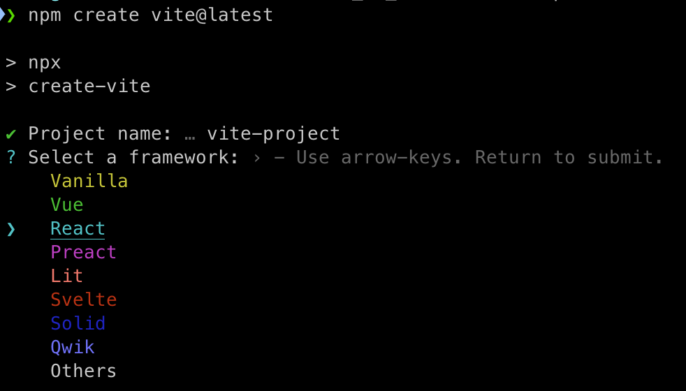
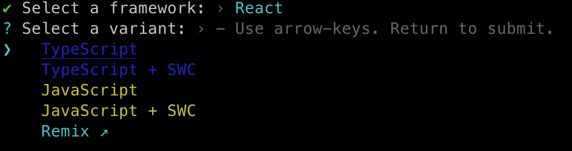
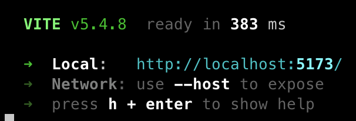

Static reference screenshots:

### GIF placeholders (manual replacement)

Replace each path with your recorded GIF file.

1. Install + first render  
   Target file: `img/placeholder-01-install-first-render.gif`
   

2. Login/auth flow  
   Target file: `img/placeholder-02-login-auth-flow.gif`
   

3. Room switching + messaging  
   Target file: `img/placeholder-03-room-switching-messaging.gif`
   

4. Push prompt + receive flow  
   Target file: `img/placeholder-04-push-flow.gif`
   

5. Widget customization before/after  
   Target file: `img/placeholder-05-widget-customization.gif`
   

6. Mobile responsive behavior  
   Target file: `img/placeholder-06-mobile-responsive.gif`
   